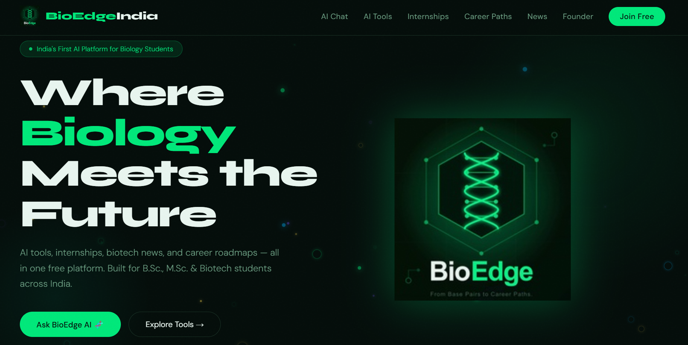

# Sanchit Kumar's Portfolio 🚀

**Live Preview**: [portfolio-mu-self-70.vercel.app](https://portfolio-mu-self-70.vercel.app/)

*(Note: Please replace the image path above with your actual portfolio screenshot if you have one)*

## About Me
Life Sciences student at Delhi University with hands-on experience in ecological research, AI-powered product development, and data analytics. Founded BioEdge India – an AI-driven platform for biology students. Certified in Generative AI and Google technologies with a demonstrated ability to translate complex biological data into impactful, scalable solutions.

## Tech Stack
React, TypeScript, Three.js, React Three Fiber, GSAP, WebGL, Node.js, Vercel

## License
This project is open source and available under the [MIT License](LICENSE).
